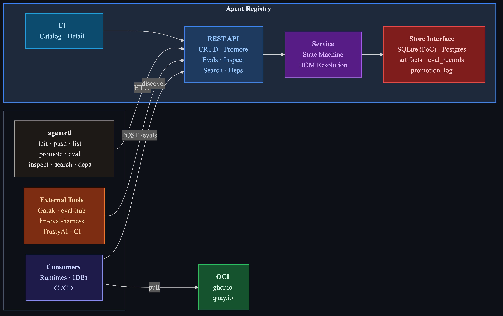
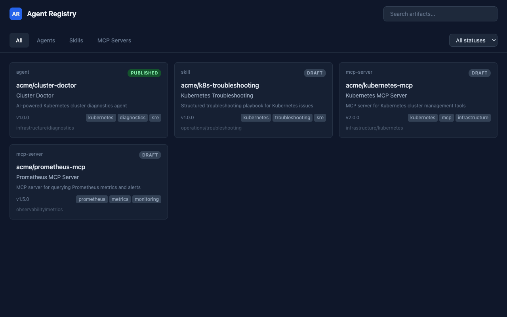
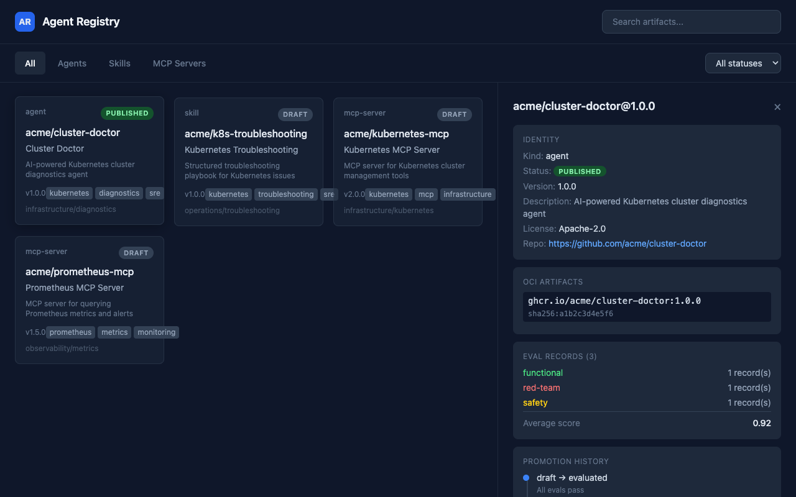

# Agent Registry

A vendor-neutral registry for AI agents, skills, and MCP servers.

Stores metadata alongside OCI registries. Accepts evaluation signals from external tools. Enforces a promotion lifecycle. Does not store binaries or compute trust scores.



## Quick Start

```bash
go build -o agentctl ./cmd/agentctl
./agentctl server start
open http://localhost:8080
```

Or run the full demo end-to-end:

```bash
./scripts/demo.sh
```

### Demo Video

A narrated walkthrough covering push, eval, promote, inspect, and dependency resolution:

https://github.com/user-attachments/assets/agent-registry-demo.mp4

To re-record locally with [showtime](https://github.com/zanetworker/showtime):

```bash
go install github.com/zanetworker/showtime/cmd/showtime@latest   # install showtime
bash docs/demo-setup.sh                          # build + start server
showtime run docs/demo.show                      # live (ENTER to advance)
showtime record docs/demo.show --narrate         # record MP4 with voice-over
bash docs/demo-teardown.sh                       # cleanup
```

Narration requires `OPENAI_API_KEY` to be set and `ffmpeg` for MP4 output.

### Presentation

A reveal.js slide deck covering the problem, architecture, and workflow:

[View presentation](https://htmlpreview.github.io/?https://github.com/zanetworker/agent-registry-spec/blob/main/docs/presentation.html) | [Source](docs/presentation.html)

Open locally: `open docs/presentation.html`

### Web UI

The server embeds a catalog UI at the root URL. Browse artifacts by kind, filter by status, search across all kinds, and click through to see identity, OCI references, eval records, promotion history, and resolved dependencies.





## How It Works

```
You build an agent        agentctl does the rest            Others find it
──────────────────        ────────────────────              ──────────────

docker push image    ──>  agentctl init --path .            agentctl search "k8s"
                          (LLM reads your code,             agentctl inspect ...
                           generates manifest)              agentctl deps ...
                                                            agentctl get ... -> docker pull
                     ──>  agentctl push agents m.yaml
                          (draft — private, mutable)

                     ──>  agentctl eval attach ...          Evals are optional.
                          (external tools submit results)   Any tool can POST /evals.

                     ──>  agentctl promote --to evaluated   Content locks here.
                     ──>  agentctl promote --to approved
                     ──>  agentctl promote --to published   Now discoverable.
```

### Step by step

**Generate a manifest.** Point `agentctl init` at your project. An LLM scans source code, Dockerfile, dependencies, and README to produce a complete YAML manifest. No manual YAML writing.

```bash
agentctl config set init.provider openai
agentctl config set init.model gpt-4o-mini
agentctl init --path ./my-agent --image ghcr.io/acme/my-agent:1.0.0 -o manifest.yaml
```

Works with Anthropic (Messages API), OpenAI (Chat Completions, Responses API), or any compatible endpoint (Ollama, vLLM, LiteLLM) via `--base-url`.

**Push it.** Lands in `draft` status.

```bash
agentctl push agents manifest.yaml
```

**Attach eval records (optional).** The registry stores results from external tools. It does not run evaluations.

```bash
agentctl eval attach agents acme/my-agent 1.0.0 \
    --category safety --provider garak --benchmark toxicity --score 0.96
```

**Promote.** Each step is a valid transition. Content becomes immutable after `evaluated`.

```bash
agentctl promote agents acme/my-agent 1.0.0 --to evaluated
agentctl promote agents acme/my-agent 1.0.0 --to approved
agentctl promote agents acme/my-agent 1.0.0 --to published
```

**Discover, inspect, deploy.**

```bash
agentctl search "kubernetes diagnostics"
agentctl inspect agents acme/my-agent 1.0.0
agentctl deps agents acme/my-agent 1.0.0
agentctl get agents acme/my-agent 1.0.0   # read OCI ref, then docker pull
```

## CLI

```
agentctl config init                     Interactive LLM provider setup
agentctl config set <key> <value>        Set config value
agentctl config show                     Show config

agentctl init -p ./project -o out.yaml   Generate manifest from code (LLM)
agentctl push <kind> <file>              Register artifact (draft)
agentctl get <kind> <name> [version]     Get artifact details
agentctl list <kind>                     List artifacts
agentctl delete <kind> <name> <version>  Delete draft
agentctl promote <kind> <name> <ver> --to <status>
agentctl eval attach <kind> <name> <ver> --category --provider --benchmark --score
agentctl eval list <kind> <name> <ver>
agentctl inspect <kind> <name> <ver>     Status + evals + promotion history
agentctl deps <kind> <name> <ver>        Dependency graph from BOM
agentctl search <query>                  Full-text search across all kinds
agentctl server start [--port] [--db]    Start server (UI at /, API at /api/v1)
```

`<kind>` is `agents`, `skills`, or `mcp-servers`.

## API

All under `/api/v1`. Responses wrapped in `{ "data": ..., "_meta": {...}, "pagination": {...} }`. Errors follow RFC 7807.

| Method | Path | |
|--------|------|-|
| GET | `/{kind}` | List |
| POST | `/{kind}` | Create (draft) |
| GET | `/{kind}/{ns}/{name}/versions/{ver}` | Get |
| DELETE | `/{kind}/{ns}/{name}/versions/{ver}` | Delete (draft only) |
| POST | `/{kind}/{ns}/{name}/versions/{ver}/promote` | Promote |
| POST | `/{kind}/{ns}/{name}/versions/{ver}/evals` | Submit eval |
| GET | `/{kind}/{ns}/{name}/versions/{ver}/evals` | List evals |
| GET | `/{kind}/{ns}/{name}/versions/{ver}/inspect` | Inspect |
| GET | `/{kind}/{ns}/{name}/versions/{ver}/dependencies` | Deps |
| GET | `/search?q=...` | Search |
| GET | `/ping` | Health |

## Project Layout

```
cmd/agentctl/       Entry point (thin — embeds UI, calls cli package)
cmd/server/         Standalone server entry point
internal/
  cli/              Cobra commands (HTTP calls + output formatting only)
  handler/          HTTP handlers (parse request, call service, write response)
  service/          Business logic (promotion state machine, BOM resolution)
  store/            Storage interface + SQLite (swappable to Postgres)
  model/            Go types matching spec schemas
  server/           Chi router, middleware, serves embedded UI
pkg/client/         HTTP client (used by CLI, usable by any Go program)
ui/index.html       Catalog UI (embedded in binary, served at /)
schemas/            JSON Schemas (spec source of truth)
api/openapi.yaml    OpenAPI 3.1 spec
docs/demo.show      Showtime demo script (recordable with narration)
scripts/demo.sh     Full lifecycle demo (bash)
SPEC.md             Specification (3700+ lines, 12 sections)
```

## Design

**Metadata, not payloads.** The registry indexes OCI artifacts. Binary content stays in ghcr.io / quay.io / ECR.

**Three artifact kinds** share identity, versioning, and promotion lifecycle. They differ in BOM structure: agents declare models + tools + skills, skills declare tool requirements, MCP servers declare transport + tools.

**Evals are external signals.** The registry accepts eval records from any tool (Garak, eval-hub, lm-eval-harness, custom CI). It does not run evaluations or compute trust scores. Trust scoring is a separate concern.

**Promotion is a state machine.** `draft -> evaluated -> approved -> published -> deprecated -> archived`. No hardcoded gates. Policy layers can be added externally.

**CLI is a thin client.** All logic is server-side. Any entry point (CLI, curl, UI, CI pipeline) behaves identically.

**Store is swappable.** SQLite for dev, Postgres for production. Implement the `Store` interface.

## Config

```
~/.config/agentctl/config.yaml

AGENTCTL_SERVER       Registry URL (default http://localhost:8080)
ANTHROPIC_API_KEY     For init with Anthropic
OPENAI_API_KEY        For init with OpenAI
```
